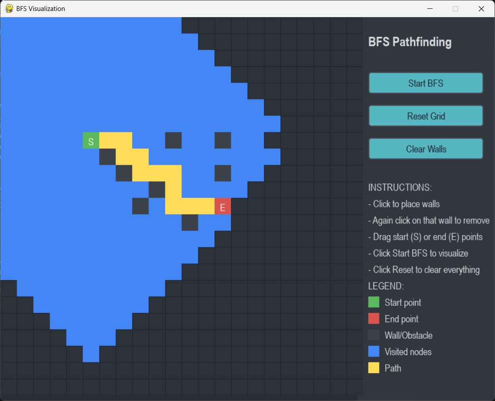

# BFS Pathfinding Visualizer
An interactive visualization tool that demonstrates the Breadth-First Search algorithm in action. 
Built with Python and PyGame, this application provides an engaging way to understand how BFS explores paths and finds the shortest route between two points.

---
## Key Features
- Interactive Grid Interface: Create custom mazes by placing obstacles
- Drag & Drop Controls: Easily reposition start and end points
- Real-time Visualization: Watch the algorithm explore paths step-by-step
- Color-coded Elements: Intuitive visual feedback for different node types
- Performance Controls: Adjustable animation speed
- Statistics Display: View path length and nodes explored

---
## Algorithm Explanation
Breadth-First Search (BFS) is a graph traversal algorithm that explores all nodes at the present depth level before moving on to nodes at the next depth level. 
In pathfinding, BFS guarantees finding the shortest path in an unweighted graph.

### How it works:
- Start from the initial node
- Explore all neighboring nodes at the present depth
- Move to the next level of nodes
- Continue until the target node is found

---
### Requirements 
- Python 3 or higher
- PyGame library

---
## Screenshot

